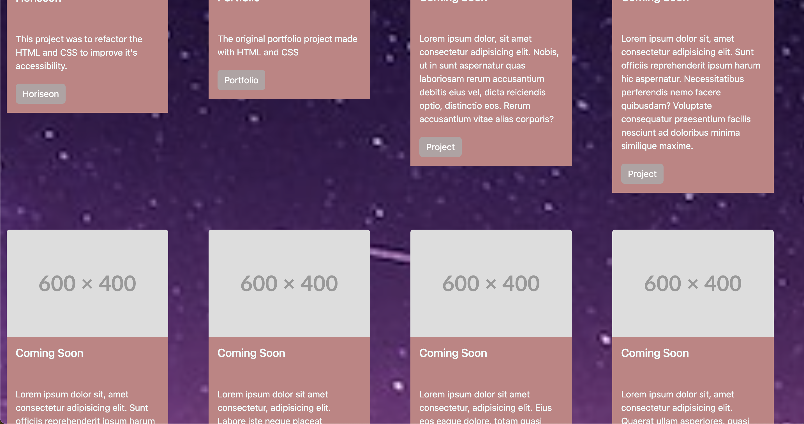
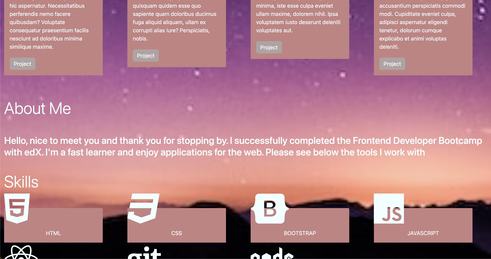
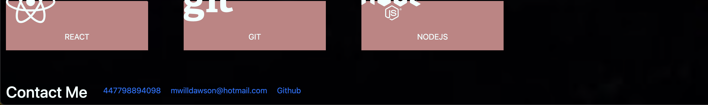

# Bootstrap-Portfolio

## Description

- This is my portfolio built using Bootstrap
- I built this portfolioto showcase my projects
- I learned the use of Bootstrap components and Fontawesome icons

## Installation

N/A


## Usage

To see my portfolio please go to https://mikewd-dev.github.io/Bootstrap-Portfolio/

```md
    
    
    
    

    ```
## Credits

### Bootstrap
    https://getbootstrap.com/

### Font Awesome
    https://fontawesome.com/

##

Please see the LICENSE in the repo